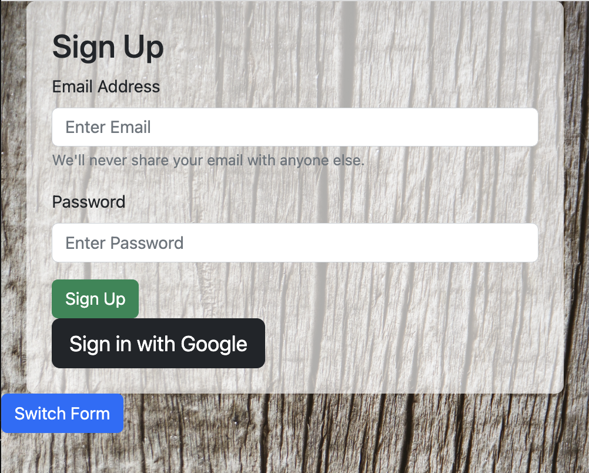

# Timber Login Page

Boca Code Week 5 Timber Login Page: We developed Login Page that provides an interface for users to log in or sign up. 

## Features

- **User Authentication**: Users can enter their credentials, such as username and password, to authenticate and access their accounts.
- **Error Handling**: The login page handles and displays appropriate error messages for invalid login attempts or missing credentials.
- **Responsive Design**: The login page is designed to be responsive, providing an optimal viewing experience across different devices.

## Technologies Used

- React
- React Bootstrap
- CSS
- JavaScript

## Getting Started

To run the Timber Login Page locally and experience the login functionality, follow these steps:

1. Clone the repository from [GitHub](https://github.com/v-cazeau/timber-login).

2. Open the `index.html` file in your preferred web browser.

3. Use the provided login form to enter your credentials and click the "Log In" button to proceed.

## Usage

Enter your username and password in the respective fields. If the provided credentials are valid, you will be granted access to the authenticated area. Otherwise, an appropriate error message will be displayed, indicating the reason for the login failure.

## Special Thanks

Special thanks to [Boca Code](https://github.com/bocacode) for this project.

## Resource
[Background Image on Login FormPexel by Miguel Á. Padriñán](https://www.pexels.com/photo/brown-wooden-surface-230515/)

---
*This project was developed as part of the Boca Code curriculum.*

